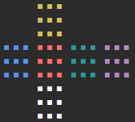

<h1 align="center">rubiks-cube.py</h1>
<p align="center"></p>
<p  align="center">Simple rubiks cube in terminal</p>

## How to use

In <a href="example.py">example.py</a> is shown example usage of <a href="cube.py">cube.py</a>

```
from cube import Cube


def main():
    cube = Cube(3)
    cube.show()
    print("Making 3 moves...")
    cube.move('X', 1, 0, qty=2)
    cube.move('Y', 0, 0, qty=1)
    cube.move('Z', 1, 1, qty=2)
    cube.show()
    print(f'Cube is{"" if cube.is_solved else " not"} solved.')

    print('Reversing these moves...')
    cube.move('Z', 1, 0, qty=2)
    cube.move('Y', 0, 1, qty=1)
    cube.move('X', 1, 1, qty=2)
    cube.show()
    print(f'Cube is{"" if cube.is_solved else " not"} solved.')

    print('Executing 100 random moves...')
    moves = cube.random_moves(100)
    cube.show()
    print(f'Cube is{"" if cube.is_solved else " not"} solved.')

    print('Reversing 100 random moves...')
    for move in reversed(moves):
        # Moves need to be executed in reversed order and also in opposite direction
        if move[2] == 0:
            move[2] = 1
        elif move[2] == 1:
            move[2] = 0
        cube.move(*move)
    cube.show()
    print(f'Cube is{"" if cube.is_solved else " not"} solved.')


if __name__ == '__main__':
    main()
```

## Requirements

- Python 3
- All packages from requirements.txt

## TODO

- [x] **Working rubiks cube of any size displayed in terminal**
- [ ] **AI solver**
- [ ] **3D visualisation**

## License

```
MIT License

Copyright (c) 2022 Artur Brytkowski

Permission is hereby granted, free of charge, to any person obtaining a copy
of this software and associated documentation files (the "Software"), to deal
in the Software without restriction, including without limitation the rights
to use, copy, modify, merge, publish, distribute, sublicense, and/or sell
copies of the Software, and to permit persons to whom the Software is
furnished to do so, subject to the following conditions:

The above copyright notice and this permission notice shall be included in all
copies or substantial portions of the Software.

THE SOFTWARE IS PROVIDED "AS IS", WITHOUT WARRANTY OF ANY KIND, EXPRESS OR
IMPLIED, INCLUDING BUT NOT LIMITED TO THE WARRANTIES OF MERCHANTABILITY,
FITNESS FOR A PARTICULAR PURPOSE AND NONINFRINGEMENT. IN NO EVENT SHALL THE
AUTHORS OR COPYRIGHT HOLDERS BE LIABLE FOR ANY CLAIM, DAMAGES OR OTHER
LIABILITY, WHETHER IN AN ACTION OF CONTRACT, TORT OR OTHERWISE, ARISING FROM,
OUT OF OR IN CONNECTION WITH THE SOFTWARE OR THE USE OR OTHER DEALINGS IN THE
SOFTWARE.
```